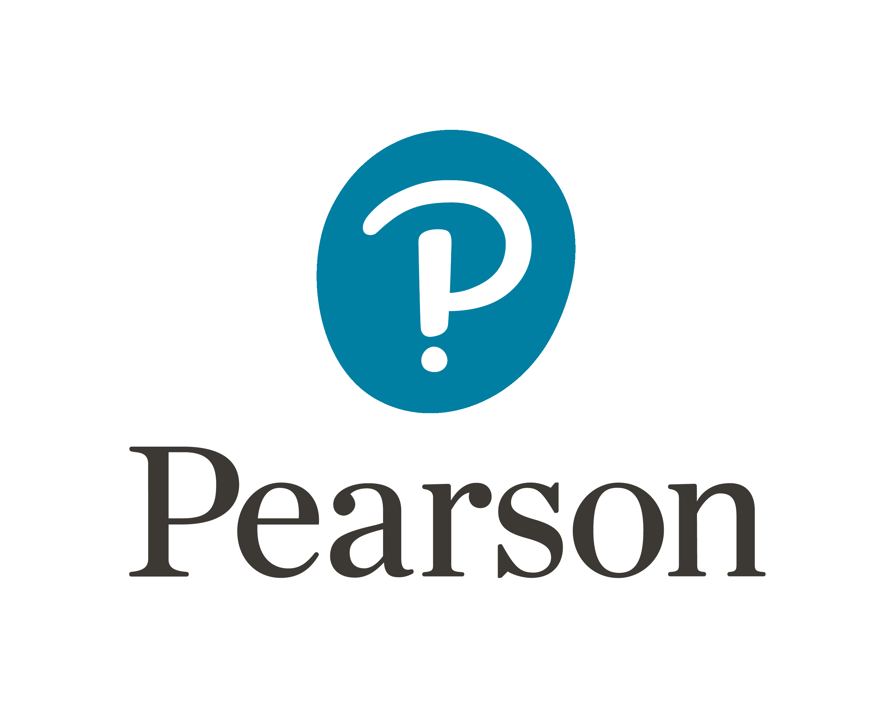

[Back to main page](./../README.md)

<h1 align="center">Experience</h1>
<table>
  <tr>
    <td>
      <b>Data Scientist</b> | United States,Texas - Turkey | Jun 2018 - Jul 2021 
      FIRST 
      <ul>
        <li> FIRST (For Inspiration and Recognition of Science and Technology) is a globally recognized organization that focuses on inspiring and engaging young people in science, technology, engineering, and mathematics (STEM) fields. 
          During the championship of the “FIRST Robotics”, I was selected as Software Lead and Ambassador. Responsible for 
          describing teams, robot,s and their properties to the politicians, journalists, and academicians which 
came from all over the world.</li>
         <li> <b> Team Leadership:</b> Proven ability to lead and inspire software development teams, providing guidance, mentorship, and fostering a collaborative work environment. </li>
         <li> <b> Agile Methodologies:</b> Experience in implementing and leading Agile practices, such as Scrum or Kanban, fostering iterative development, continuous integration, and delivering value incrementally.</li>
         <li> <b> Skills: </b> Scrum · Jira · Kanban · Adobe </li>
      </ul>
    </td>
   <td>
  
</td>
  </tr>
  <tr>
    <td>
      <b>Researcher</b> | Texas, United States (Seasonal) |  June 2018 - Jul 2018  
      Rice University  
      <ul>
        <li> Regarding my research on neuroscience and "Implant Microchip Technology", I seized the opportunity to continue my studies at Rice University. Worked as production (prototype) and databases part. </li>
        <li> <b> Microchip Programming:</b>Proficiency in programming and configuring microchips to perform specific functions or gather and transmit data.</li>
        <li> <b> Wireless Communication:</b> Experience with wireless communication protocols such as RFID (Radio Frequency Identification) or NFC (Near Field Communication) for data transmission and interaction with external devices. </li>
        <li> <b> Programming Languages: </b> Strong programming skills in languages commonly used in data science, such as SQL, PostgreSQL. </li>
        <li> <b> Data Wrangling: </b> Experience in cleaning, transforming, and preparing raw data for analysis using tools like SQL, or data preprocessing libraries. </li>
        <li> <b> Skills: </b> RFID · Molecular Biology · SQL · Machine Learning · Artificial Intelligence (AI)</li>
      </ul>
    </td>
    <td>
  
</td>
  </tr>
    <tr>
    <td>
      <b>Web Developer, Pearson</b> | Texas, United States (Seasonal- Remote) |  May 2019 - Jul 2020  
      Pearson  
      <ul>
        <li>Experienced as a Web Developer, and lead for commercial and public relations. </li>
         <li> <b> Web Development:</b> Proficiency in HTML, CSS, and JavaScript, along with experience in front-end frameworks like Figma.</li>
        <li> <b> Back-end Development: </b>Knowledge of server-side programming languages such as Node.js and Python.</li>
        <li> <b> Database Management: </b> Experience with database systems such as MySQL and PostgreSQL. Knowledge of SQL and NoSQL database querying. </li>
        <li> <b> Version Control: </b> Proficiency in using Git version control systems to manage codebase and collaborate effectively with a development team. </li>
        <li> <b> UI/UX Design: </b> Understanding of user-centered design principles, ability to create visually appealing interfaces, and optimize user experience.</li>
        <li> <b> Problem-Solving: </b> Strong analytical and problem-solving skills to troubleshoot issues and find effective solutions.</li>
        <li> <b> Collaboration and Communication: </b> Ability to work collaboratively within a team, communicate effectively with stakeholders, and manage project requirements. </li>
        <li> <b> Skills:</b> UML Tools · CSS · Git · Figma · Python · SQL · HTML · Web Development</li>
      </ul>
    </td>
    <td>
  
</td>
  </tr>
  <tr>
    <td>
      <b>Researcher</b> | Poland, Krakow |  Jan 2023 - May 2023  
      AGH Science and Technology University  
      <ul>
        <li>Research about SQL and PostgreSQL.</li>
        <li> <b> Skills</b> :  SQL · PostgreSQL · SCRUM </li>
      </ul>
    </td>
   <td>
  
</td>
</table>

[Back to main page](./../README.md)
